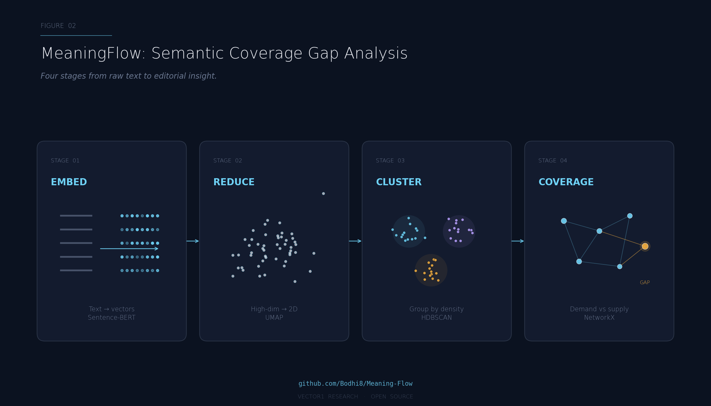

# MeaningFlow

**Semantic content modeling and coverage gap analysis.**

MeaningFlow measures how thoroughly your content covers the topics your audience is searching for — and shows you exactly where the gaps are.

It takes two corpora (your content and your users' queries), embeds them into a shared semantic space, clusters by topic, builds a graph of relationships between clusters, and computes coverage gaps: areas of high demand with no corresponding supply. The output is a ranked list of opportunities your editorial and content teams can act on immediately.

Built on Sentence-BERT, UMAP, HDBSCAN, and NetworkX.



---

## Quickstart

```bash
pip install meaningflow
```

```python
from meaningflow import SemanticGraph

# What users are searching for (demand)
queries = ["how to train a puppy", "best dog food", "cat litter reviews", ...]

# What your site already covers (supply)
content = ["Puppy Training 101", "Dog Food Buyer's Guide", ...]

# Build semantic graphs for both
demand = SemanticGraph(texts=queries, embedder="all-MiniLM-L6-v2", min_cluster_size=30)
demand.fit()

supply = SemanticGraph(texts=content, embedder="all-MiniLM-L6-v2", min_cluster_size=30)
supply.fit()

# Find where demand exists but supply doesn't
gaps = demand.coverage_gaps(reference=supply, similarity_threshold=0.55)

for gap in gaps[:10]:
    print(f"Gap (n={gap.size}): {gap.top_terms[:5]}  volume={gap.volume}")
```

Output:
```
Gap (n=142): ['cat anxiety', 'stressed cat', 'cat hiding', 'nervous cat behavior', 'calm cat'] volume=3420
Gap (n=89):  ['reptile habitat', 'terrarium setup', 'gecko care', 'snake enclosure', 'heat lamp'] volume=2105
Gap (n=67):  ['pet insurance cost', 'vet bill help', 'pet health plan', 'cheap pet insurance', 'emergency vet'] volume=1890
...
```

Each gap cluster represents a topical area where your audience has demand but your content has no coverage. These are your highest-priority content opportunities.

---

## How It Works

MeaningFlow runs a four-stage pipeline:

**1. Embed** — Convert texts into dense vectors using a Sentence-BERT model. "How to train a puppy" and "puppy training tips" land near each other in this space even without shared keywords.

**2. Reduce** — Project high-dimensional embeddings into a lower-dimensional space using UMAP. This stabilizes clustering and makes the structure visualizable.

**3. Cluster** — Group similar vectors by density using HDBSCAN. Each cluster represents a coherent topic. Outliers (the `-1` bucket) are texts too unique to cluster — typically 10-25% of a healthy corpus.

**4. Graph + Coverage** — Build a NetworkX graph over the clusters, connecting those with high inter-cluster similarity. Then compare demand clusters against supply clusters to find gaps: regions of the demand graph with no nearby supply.

---

## Core API

### `SemanticGraph`

The main entry point. Wraps the full embed → reduce → cluster → graph pipeline into a single object.

```python
from meaningflow import SemanticGraph

sg = SemanticGraph(
    texts=["list", "of", "strings"],
    embedder="all-MiniLM-L6-v2",   # any Sentence-BERT model
    min_cluster_size=30,            # HDBSCAN param: min points per cluster
    min_samples=10,                 # HDBSCAN param: core point threshold
    umap_n_neighbors=30,            # UMAP param: local neighborhood size
    umap_n_components=10,           # UMAP param: reduced dimensions
    random_state=42,                # reproducibility
)

sg.fit()
```

**Properties after fitting:**

| Property | Type | Description |
|----------|------|-------------|
| `sg.n_clusters` | `int` | Number of clusters found (excluding noise) |
| `sg.labels` | `np.ndarray` | Cluster label per text (-1 = noise) |
| `sg.clusters` | `list[Cluster]` | List of `Cluster` objects with metadata |
| `sg.embeddings` | `np.ndarray` | Raw embeddings |
| `sg.reduced` | `np.ndarray` | UMAP-reduced embeddings |
| `sg.graph` | `nx.Graph` | NetworkX graph over clusters |
| `sg.noise_ratio` | `float` | Fraction of texts in the noise bucket |

### `SemanticGraph.coverage_gaps()`

Compare this graph against a reference graph to find gap clusters.

```python
gaps = demand.coverage_gaps(
    reference=supply,
    similarity_threshold=0.55,   # min cosine similarity to count as "covered"
)
```

Returns a list of `GapCluster` objects, sorted by volume descending.

### `Cluster`

Represents a single topic cluster.

| Attribute | Type | Description |
|-----------|------|-------------|
| `cluster.id` | `int` | Cluster label from HDBSCAN |
| `cluster.size` | `int` | Number of texts in this cluster |
| `cluster.top_terms` | `list[str]` | Most representative texts (by proximity to centroid) |
| `cluster.centroid` | `np.ndarray` | Mean embedding of cluster members |
| `cluster.texts` | `list[str]` | All texts assigned to this cluster |

### `GapCluster`

A demand cluster with no matching supply cluster.

| Attribute | Type | Description |
|-----------|------|-------------|
| `gap.id` | `int` | Cluster label from the demand graph |
| `gap.size` | `int` | Number of queries in this cluster |
| `gap.top_terms` | `list[str]` | Most representative queries |
| `gap.volume` | `int` | Total search volume (if volume data provided) |
| `gap.nearest_supply` | `str` | Label of the closest supply cluster |
| `gap.nearest_similarity` | `float` | Cosine similarity to that nearest supply cluster |

---

## Use Cases

**Taxonomy design.** Run MeaningFlow on your query logs. The resulting clusters are a data-driven proposal for your category hierarchy. Editors review the clusters, name them, and decide which deserve branches in the taxonomy.

**Content gap analysis.** Compare demand (queries) against supply (existing content). The gaps are your editorial roadmap, ranked by volume.

**Synonym discovery.** Terms that consistently co-occur in the same cluster across queries are candidates for synonym pairs. Extract them programmatically and route to editorial review.

**Classifier sanity checking.** Run a classifier's output back through MeaningFlow. If a document is classified as "Hip-Hop" but its embedding sits inside a "Classical" cluster, that's a flag for human review.

**Drift monitoring.** Run MeaningFlow monthly. Compare the current demand graph against last month's. New clusters = emerging topics. Shrinking clusters = declining interest. Rising gap count = your content is falling behind.

---

## Advanced Usage

### Using your own embeddings

If you've already embedded your texts elsewhere, pass them directly:

```python
import numpy as np

my_embeddings = np.load("precomputed_embeddings.npy")

sg = SemanticGraph(
    texts=my_texts,
    embeddings=my_embeddings,   # skip the embedding step
    min_cluster_size=30,
)
sg.fit()
```

### Providing volume data

For coverage gap analysis with search volume weighting:

```python
demand = SemanticGraph(
    texts=queries,
    volumes=query_volumes,   # list[int], same length as texts
    embedder="all-MiniLM-L6-v2",
)
demand.fit()

# Gaps are now sorted by total volume, not just cluster size
gaps = demand.coverage_gaps(reference=supply)
```

### Exporting to Neo4j

```python
from meaningflow.export import to_neo4j

to_neo4j(
    demand,
    uri="bolt://localhost:7687",
    auth=("neo4j", "password"),
    database="meaningflow",
)
```

Creates nodes for each cluster and edges for inter-cluster relationships. Cluster properties include top terms, size, and centroid coordinates.

### Quarterly health check

```python
from meaningflow import SemanticGraph
import json

# Fit current demand and supply
demand = SemanticGraph(texts=current_queries, embedder="all-MiniLM-L6-v2")
demand.fit()

supply = SemanticGraph(texts=current_content, embedder="all-MiniLM-L6-v2")
supply.fit()

gaps = demand.coverage_gaps(reference=supply)

report = {
    "supply_clusters": supply.n_clusters,
    "demand_clusters": demand.n_clusters,
    "gap_clusters": len(gaps),
    "noise_ratio_demand": demand.noise_ratio,
    "noise_ratio_supply": supply.noise_ratio,
    "top_gaps": [
        {"terms": g.top_terms[:5], "volume": g.volume, "size": g.size}
        for g in gaps[:20]
    ],
}

with open("semantic_health_report.json", "w") as f:
    json.dump(report, f, indent=2)
```

---

## Installation

**From PyPI:**
```bash
pip install meaningflow
```

**From source:**
```bash
git clone https://github.com/Bodhi8/Meaning-Flow.git
cd Meaning-Flow
pip install -e ".[all]"
```

**Dependencies:**
- Python >= 3.9
- sentence-transformers >= 2.2.0
- umap-learn >= 0.5.3
- hdbscan >= 0.8.33
- networkx >= 3.1
- numpy, pandas, scikit-learn, scipy, tqdm

**Optional (visualization):**
```bash
pip install meaningflow[viz]
```

Adds matplotlib, plotly, and seaborn for cluster visualization.

---

## Project Structure

```
meaningflow/
    __init__.py          # Public API: SemanticGraph, Cluster, GapCluster
    core.py              # SemanticGraph implementation
    embeddings.py        # Sentence-BERT encoding
    clustering.py        # UMAP reduction + HDBSCAN clustering
    graph.py             # NetworkX graph construction
    coverage.py          # Coverage gap analysis
    models.py            # Cluster and GapCluster dataclasses
    export/
        __init__.py
        neo4j.py         # Neo4j graph export
notebooks/
    demo_coverage_gaps.ipynb
data/
    examples/
        sample_queries.csv
        sample_content.csv
assets/
    meaningflow-pipeline.png
```

---

## Related Work

MeaningFlow is part of a broader set of open-source tools from [Vector1 Research](https://vector1.ai):

- **[Papilon](https://github.com/Bodhi8/papilon)** — Marketing mix modeling, causal discovery, and complex systems simulation
- **[PyCausalSim](https://github.com/Bodhi8/pycausalsim)** — Causal discovery through simulation

For a detailed walkthrough of how MeaningFlow fits into a knowledge engineering stack, see:
- [Knowledge Engineering for Search and Content: A Practical Guide](https://medium.com/@brian-curry-research)
- [Building a Knowledge Engineering System: An Engineering Guide](https://medium.com/@brian-curry-research)

---

## Contributing

See [CONTRIBUTING.md](CONTRIBUTING.md) for guidelines. Issues, feature requests, and PRs welcome.

---

## License

MIT — see [LICENSE](LICENSE) for details.

---

## Citation

```bibtex
@software{meaningflow2025,
    title = {MeaningFlow: Semantic Content Modeling and Coverage Gap Analysis},
    author = {Brian Curry},
    year = {2025},
    url = {https://github.com/Bodhi8/Meaning-Flow}
}
```

---

*Built by [Brian Curry](https://linkedin.com/in/briancurry) / [Vector1 Research](https://vector1.ai)*
